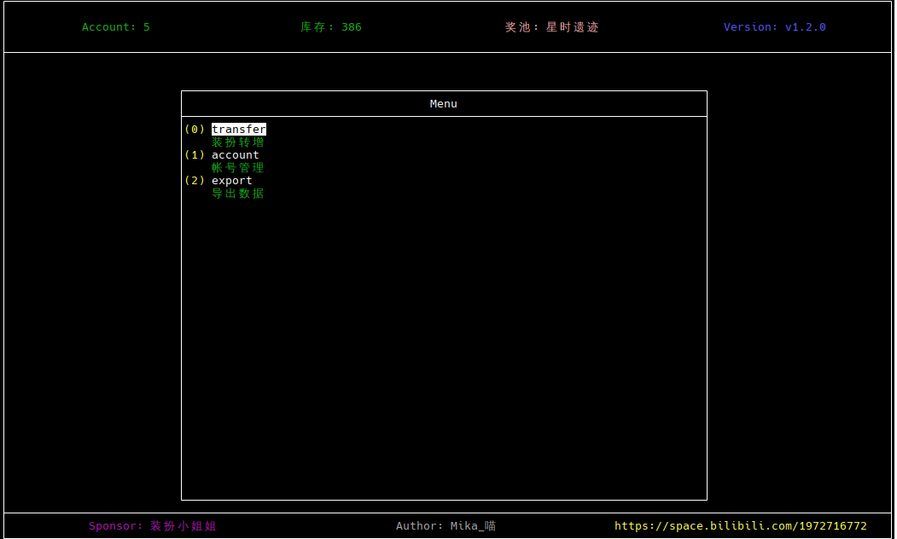

# 装扮大会管理工具

## 功能简介
- 支持扫码登录
- 支持多个帐号同时管理
- 支持装扮直接赠送 (使用 UID)
- 支持导出装扮库存, 方便闲鱼上货
- 针对 Terminal 环境开发

## 使用方法
- 请使用 [Windows Terminal](https://apps.microsoft.com/detail/9n0dx20hk701?rtc=1&hl=zh-cn&gl=CN) 运行, 使用默认 `cmd` 可能会出现无法正常显示的 BUG
- tui 支持鼠标滚动和点击

## 常见错误
当扫码遇到 ```请使用最新版 APP 登录``` 时, 请在 APP 上退出帐号后重新登录即可, 无需更新 APP

## 预览

